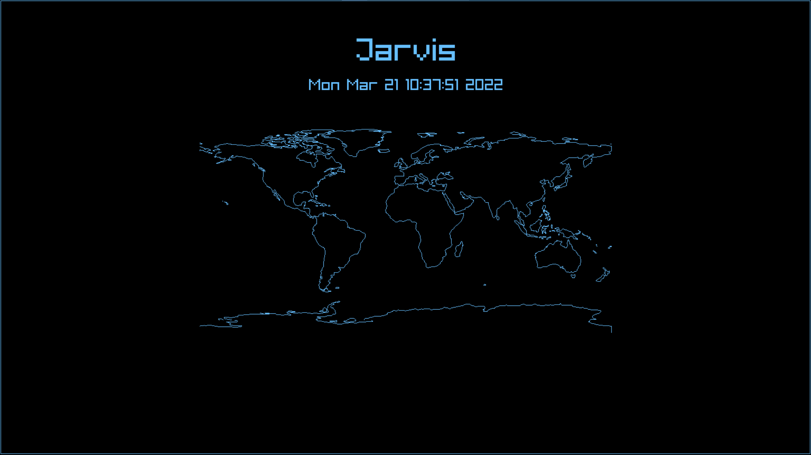

# Windows Installation
Please click into the `graphics-service` folder and install the graphics service via a docker container. Instructions will be posted on the README in that folder.

# Mac/Linux Installation
Coming soon!

# Creating a Pull Request (PR)

In order to standardize the process of making changes to the main repositoy, we will be utilizing pull requests (PRs). PRs are heavily utilized in industry as they distinguish between the large code base and local changes. Additionally, the organization of the changes allows for easier cherry-picks and releasing regularly on a scrum cycle.

In order to make a pull request, first fork this repository (you can click the button in the top left of the website that says "Fork"). After doing so, clone that repository locally and create a new branch called something like "weather-widget".

Then, develop your code as you normally would. Once you believe your changes are adequate enough to be part of the main code base, you're ready to start a PR!

To begin, ensure all of your code is committed and pushed to your forked repository. Then, go to github's website and there will be an option now available to create a PR at the top of the screen. Go ahead and click it and ensure that the PR is from "weather-widget" on your forked repository (or whatever you called it) to "main" on ECLAIR/Smart-Mirror. Then, provide a brief description as to what changes were made. If there were any graphics changes, please include a picture/video so it's easier to review.

Then, if there are no merge conflicts, just wait for me (Sahil) to review your code and I'll leave some feedback if need be. If there are merge conflicts, don't panic! They sound super scary but they're not too bad don't worry.

If you have a merge conflict, you can follow the instructions listed on the website to pull the most recent changes and merge the branch locally. These conflicts usually mean that someone else merged code into the codebase that you're also trying to change. Git then gets confused because it doesn't know what changes should actually be there. Therefore, once you've pulled and resolved the changes and pushed, it should be good to go!

Sidenote, if you ever want the changes from the main codebase onto your forked repository's branch, type the following command:

```$ git fetch upstream```