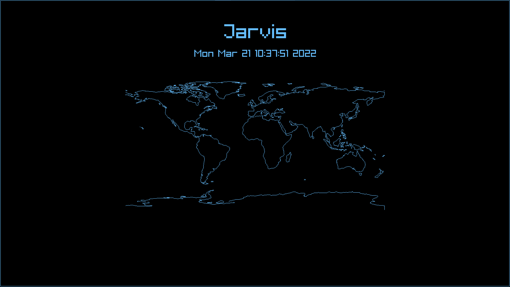

# Windows Installation

In order to run raylib on Windows, please ensure that you have an Nvidia chip in your machine. If you do not, please let me know, and we can work something out.

For this setup, you will need two technologies: [VcXsrc X-server](https://sourceforge.net/projects/vcxsrv/) and [Docker](https://www.docker.com/). Docker, if you're unfamiliar, is a software that will allow you to run code in different OS environments. In our case, we'll be running it in a Linux container. However, our application is also a graphics application. That is where X-servers come in to play. Essentially, they allow us to stream video information to a particular port. Please install those programs before proceeding.

Once you have X-Server installed, launch it (it may be under the name "X-Launch"). After doing so, set `Display Number` to 0 and hit next. Ensure `Start no client` is selected and hit next. This next screen is VERY IMPORTANT! Please make sure to **uncheck** `Native opengl` and **check** `Disable access control`. This configuration is crucial to getting the X-Server graphics working. Then, hit next and the finish. Congrats, your X-Server should now be working in the background!

Now, we have to create our docker container. To do so, open up your terminal or command prompt and navigate to the directory where all of this code is. After doing so, run the following command (feel free to replace `sahiljain/smart-mirror` with any name of your choice):

```docker build -t sahiljain11/smart-mirror .```

or

```docker build -t <name_of_container> .```

This initial command will take a while to compute. Don't worry! It should be done in around ~10 minutes. You only need to do this once so you don't have to worry about this anymore while developing. Now, we can run our container using the following command:

```docker run --rm -i -t -v %cd%:/usr/smart-mirror -w /usr/smart-mirror -e DISPLAY=<ip_address>:0.0 <name_of_container>```

In order to get the ip address of your network, you can enter `ipconfig`, and under `Wireless LAN adapter Wi-Fi`, you can find the IPv4 address.

Once inside the docker container, run the following:

```$ make raylib```

If there's an error about caching, run the following command:

```$ cmake --build .```

Once that's done, you can do the following and a graphics screen should pop up!

```$ ./jarvis.csj```

# Creating a Pull Request (PR)

In order to standardize the process of making changes to the main repositoy, we will be utilizing pull requests (PRs). PRs are heavily utilized in industry as they distinguish between the large code base and local changes. Additionally, the organization of the changes allows for easier cherry-picks and releasing regularly on a scrum cycle.

In order to make a pull request, first fork this repository (you can click the button in the top left of the website that says "Fork"). After doing so, clone that repository locally and create a new branch called something like "weather-widget".

Then, develop your code as you normally would. Once you believe your changes are adequate enough to be part of the main code base, you're ready to start a PR!

To begin, ensure all of your code is committed and pushed to your forked repository. Then, go to github's website and there will be an option now available to create a PR at the top of the screen. Go ahead and click it and ensure that the PR is from "weather-widget" on your forked repository (or whatever you called it) to "main" on ECLAIR/Smart-Mirror. Then, provide a brief description as to what changes were made. If there were any graphics changes, please include a picture/video so it's easier to review.

Then, if there are no merge conflicts, just wait for me (Sahil) to review your code and I'll leave some feedback if need be. If there are merge conflicts, don't panic! They sound super scary but they're not too bad don't worry.

If you have a merge conflict, you can follow the instructions listed on the website to pull the most recent changes and merge the branch locally. These conflicts usually mean that someone else merged code into the codebase that you're also trying to change. Git then gets confused because it doesn't know what changes should actually be there. Therefore, once you've pulled and resolved the changes and pushed, it should be good to go!

Sidenote, if you ever want the changes from the main codebase onto your forked repository's branch, type the following command:

```$ git fetch upstream```